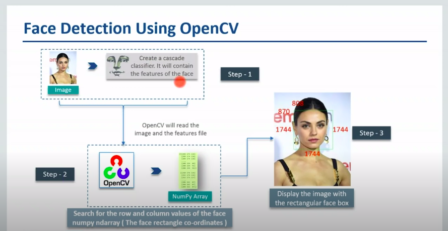

# OpenCv with python

- import cv2
- this cv2 module of opencv which handles all methods.
- human can read image, video but computer can only reads piexel and bits
- open cv classifed the image on matrix

## Methods of OpenCv

```sh
import cv2

# 1 is decide for color image
img = cv2.imread('<image>', 1)

# 0 for black and white image
imge_1 = cv2.imread('<image>', 0)

print(img)   # print 3d matrix

```
### Display image


- imshow is method of opencv library which is used to display the image
- waitKey for time to close the display image
- destroyAllWindows method for closing the window

## Face detection


- here we gone learn about the how face detection works
 1. Read the image, create cascade classifier. It will contains the feature of Face
 2. Search for row and colomn of the face numpy ndarray(face rectangles co-ordinates) 
