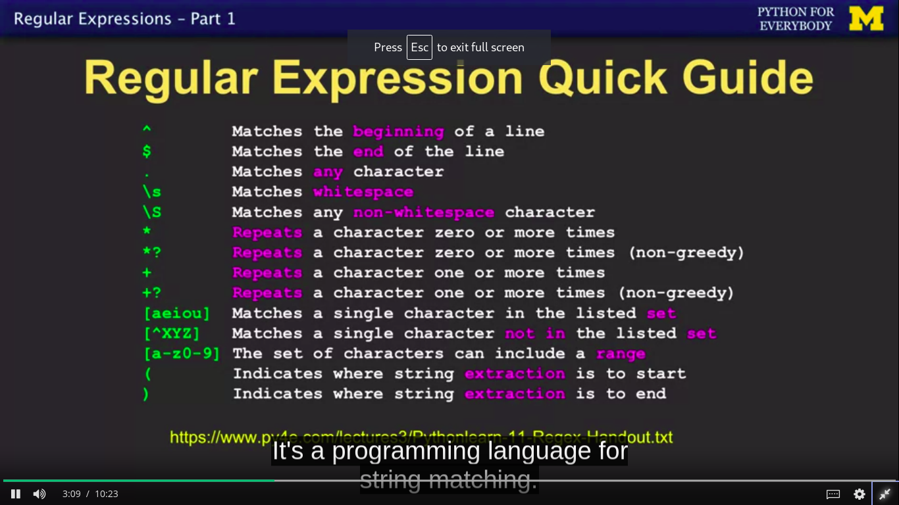

## Regular Exprresion

- Regular expression is pattern to used the mathing of characters.

#### Library of Regular Expression in python
- import re     // re is the library of regular expression.

### Some syntax of RE

#### some method of "re" library
- search
  1. re.search()    // search method work like find() if you find any word or pattern then we can use search.
